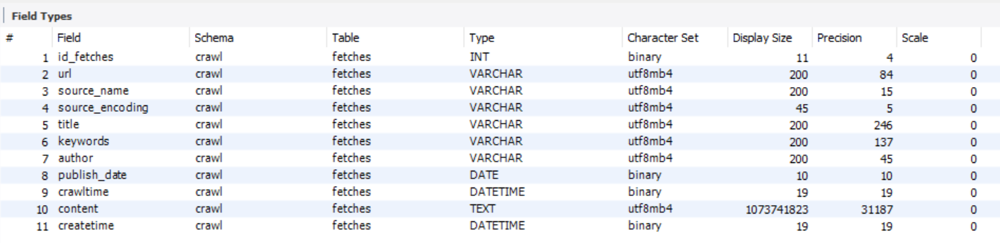
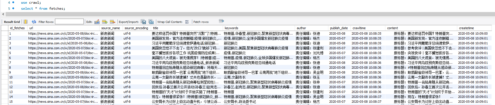

# News Detector

​	News Detector是一个使用Node.js搭建的新闻搜索引擎，定时（per 2h）自动爬取各大新闻门户网站，并提供检索功能，对检索话题（关键词）进行热度、新鲜程度的反馈，并返回所有能找到的新闻。（如新浪新闻、网易新闻等，或某垂直领域权威性的网站如经济领域的雪球财经、东方财富等，或者体育领域的腾讯体育、虎扑体育等）

​	由于作者初涉js语言，为起练习作用，分为无框架、使用框架两个版本进行开发，对应分支WithoutFramework和Express。无框架版本旨在深入理解体会Node.js语言的异步非阻塞特性，有框架版本着重于对服务层结构、服务层与视图层交互的理解。两个版本后端爬虫无区别。以下介绍以有框架版本为主。

[toc]

## File Structure

.

|--- bin/

|           |--- node_modules/

|           |--- package.json

|           |--- package-loick.json

|--- public/

|           |--- css/

|           |--- fonts/

|           |--- img/

|           |--- js/

|           |--- vendor/	测试用的开发依赖项

|           |--- home.handlebars	搜索主页

|           |--- news.handlebars	新闻页面

|--- fetches.sql	数据库表schema

|--- mysql.js	连接数据库模块

|--- crw_163.js	爬虫：网易新闻

|--- crw_chinanews.js	爬虫：中国新闻网

|--- crw_sina.js	爬虫：新浪新闻

|--- app.js	服务器

## Dependency

安装运行时依赖包:

```cmd
npm install --save fs request cheerio iconv-lite date utils node-schedule mysql moment body-parser express express3-handlebars
```

安装开发时依赖包:

```cmd
npm install --save-dev mocha
```

#### 后端：

数据库使用MySQL，运行在本地3036端口；爬取数据的CRUD入口函数在mysql.js中定义；表名fetches，schema如下：

经时两天左右，自动爬取得1.24K条新闻信息。数据总览：



#### 服务层：

​	框架使用了较常见的express；

#### 前端：

​	考虑到已有html文件，视图引擎没有选用较流行的ejs、jade等，而是选择了handlebars，原因是handlebars语法上更贴近html语言，不必另行迁移。


## Guide

1. **开启MySQL服务**

   ```cmd
   net start mysql
   ```

   在sql shell中：

   ```sql
   create database crawl;
   use crawl;
   create table `fetches` (
     `id_fetches` int(11)  NOT NULL AUTO_INCREMENT,
     `url` varchar(200) DEFAULT NULL,
     `source_name` varchar(200) DEFAULT NULL,
     `source_encoding` varchar(45) DEFAULT NULL,
     `title` varchar(200) DEFAULT NULL,
     `keywords` varchar(200) DEFAULT NULL,
     `author` varchar(200) DEFAULT NULL,
     `publish_date` date DEFAULT NULL,
     `crawltime` datetime DEFAULT NULL,
     `content` longtext,
     `createtime` datetime DEFAULT CURRENT_TIMESTAMP,
     PRIMARY KEY (`id_fetches`),
     UNIQUE KEY `id_fetches_UNIQUE` (`id_fetches`),
     UNIQUE KEY `url_UNIQUE` (`url`)
   ) ENGINE=InnoDB DEFAULT CHARSET=utf8;
   ```

2. **开启爬虫**（在不同终端中）：

   ```cmd
   npm crw_163.js
   npm crw_chinanews.js 
   npm crw_sina.js
   ```

   爬取会按照设定每2h进行，时间设定代码在crw*文件：

   ```javascript
   var rule = new schedule.RecurrenceRule();
   var times = [1,3,5,7,9,11,13,15,17,19,21,23]; //第几个小时自动执行
   var times2 = 01; //定义在第几分钟执行
   rule.hour = times;
   rule.minute = times2;
   ```

   可根据需要自行修改。

3. **开启网页服务**：

   ```cmd
   node app.js
   ```

   浏览器访问 http://127.0.0.1:3000/ 进入新闻检索页面。

   

## Demo

无框架版本：


使用express框架版本：


## Annotation

​	关于无框架版本编写时候的学习历程&具体代码细节，可移步博客https://blog.csdn.net/weixin_43881961/article/details/106003866。

坑边闲话：

​	近一年一直忙于学习与各种项目ddl，少有完整地整理某个项目的学习历程，实是惭愧。一则以为个人的笔记其实拙浅、比起document无大的查询意义；二则，一些我想动笔写写的项目却是合作项目，对他人代码进行详解总需空闲，只对自己的部分详述又不美。

​	此处也能算一个开始，希望所有写过的代码踩过的坑都能被规整成历程吧。可以期待。
